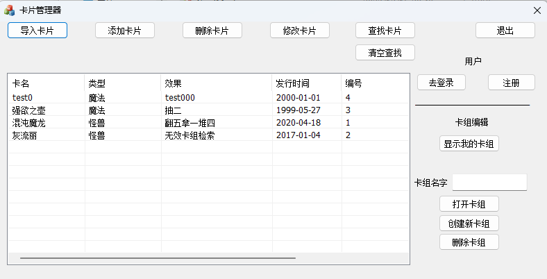

# CardMaster 卡片管理器

使用方法：

1.下载 /bin/CardMaster.exe 以及 /bin/db_login.txt

2.在数据库里创建 schema 以及 table，具体见下

3.将 db_login.txt 内的参数按照实际情况修改

4.运行 CardMaster.exe

----------------------------------------------------------

数据库初始化

Schema: 自定义名字，记得在 db_login.txt 里面改成对应的

Tables: 

// 创建卡片总表

CREATE TABLE `info1` (

  `name` varchar(255) NOT NULL,
  
  `type` varchar(255) DEFAULT NULL,
  
  `effect` varchar(255) DEFAULT NULL,
  
  `issue_time` varchar(255) DEFAULT NULL,
  
  `number` int DEFAULT NULL,
  
  PRIMARY KEY (`name`)
  
);

// 创建用户卡组表

CREATE TABLE `user_group` (

  `id` int NOT NULL AUTO_INCREMENT,
  
  `group_name` varchar(255) DEFAULT NULL,
  
  `username` varchar(255) NOT NULL,
  
  PRIMARY KEY (`id`)
  
);

// 创建用户信息表

CREATE TABLE `userinfo1` (

  `ID` varchar(255) NOT NULL,
  
  `password` varchar(255) NOT NULL,
  
  PRIMARY KEY (`ID`)
  
);
